<div align="center">

# Forge

### Durable distributed task orchestration across Java and C++

[](controller/build.gradle)
[](worker/CMakeLists.txt)
[](controller/build.gradle)
[](proto/forge.proto)
[](docker-compose.yml)

Forge is a from-scratch execution engine for running shell commands on remote workers. It combines a Spring Boot control plane, a multithreaded C++ worker, a bidirectional gRPC command stream, PostgreSQL-backed state, DAG workflows, and failure-aware recovery.

[Quick start](#quick-start) · [Architecture](docs/architecture.md) · [API](docs/api.md) · [Development](docs/development.md) · [Operations](docs/operations.md)

</div>

> [!IMPORTANT]
> Forge executes arbitrary processes and currently has no authentication or transport encryption. It is a systems-engineering project intended for trusted development environments, not an internet-facing production deployment. See [Security](SECURITY.md).

## Why this project is interesting

Forge focuses on the parts of distributed execution that become difficult after the happy path:

- **Durable worker events:** task-start and task-result messages are persisted to a filesystem outbox before transmission, replayed after reconnects, and removed only after controller acknowledgement.
- **Worker session fencing:** a stable worker ID is paired with a per-process session ID so stale incarnations cannot report results or reclaim authority.
- **Atomic takeover:** PostgreSQL stores the authoritative worker session, retired sessions, and recovery grace periods so controller restarts do not erase ownership decisions.
- **DAG workflows:** dependency validation rejects missing nodes, self-dependencies, and cycles; downstream tasks are released or skipped as prerequisites resolve.
- **Failure-aware execution:** bounded exponential retry, worker-loss recovery, cancellation, timeouts, ordered attempts, and persisted execution timelines are built into the model.
- **Capacity-aware scheduling:** the controller reserves worker capacity atomically and selects by effective load, CPU usage, and a deterministic worker-ID tie-breaker.

## System at a glance

<picture>
  <source media="(prefers-color-scheme: dark)" srcset="docs/diagrams/system-overview-dark.svg">
  <source media="(prefers-color-scheme: light)" srcset="docs/diagrams/system-overview-light.svg">
  
</picture>

The REST API is the user-facing control surface. The controller persists logical tasks and physical attempts, schedules work onto connected workers, and reconciles failure. Workers execute commands in dedicated process groups and use the outbox to bridge network or controller outages. The shared [Protocol Buffers contract](proto/forge.proto) keeps both runtimes aligned.

## Quick start

### Prerequisites

- Java 21
- Docker with Compose support
- CMake 3.20+ and a C++20 compiler
- Protobuf and gRPC C++ development packages
- Linux or macOS for the worker (`fork`, `execvp`, process groups, and POSIX signals are used)

On Ubuntu/Debian, the worker dependencies are typically available as:

```bash
sudo apt-get install build-essential cmake pkg-config \
  protobuf-compiler protobuf-compiler-grpc libprotobuf-dev libgrpc++-dev
```

### 1. Start PostgreSQL

```bash
docker compose up -d
```

Compose exposes PostgreSQL on `localhost:5433` and Flyway applies the schema when the controller starts.

### 2. Start the controller

```bash
cd controller
./gradlew bootRun
```

The REST API listens on `http://localhost:8080`; the worker control plane listens on `localhost:50051`.

### 3. Build and start a worker

From another terminal at the repository root:

```bash
cmake -S worker -B worker/build
cmake --build worker/build --parallel
./worker/build/forge-worker --controller=localhost:50051
```

### 4. Submit a workflow

```bash
curl -sS -X POST http://localhost:8080/api/workflows \
  -H 'Content-Type: application/json' \
  -d '{
    "name": "demo-pipeline",
    "tasks": [
      {
        "key": "prepare",
        "command": "/bin/sh",
        "arguments": ["-c", "printf prepared"],
        "maxAttempts": 2,
        "timeoutSeconds": 30
      },
      {
        "key": "verify",
        "command": "/bin/sh",
        "arguments": ["-c", "printf verified"],
        "dependsOn": ["prepare"]
      }
    ]
  }'
```

The response contains the workflow ID and generated task IDs. Inspect progress with:

```bash
curl -sS http://localhost:8080/api/workflows/<workflow-id>
curl -sS http://localhost:8080/api/workflows/<workflow-id>/events
curl -sS http://localhost:8080/api/workers
```

## Core model

| Concept | Role |
| --- | --- |
| **Workflow** | A validated DAG of named tasks. Successful nodes are preserved when failed workflows are manually retried. |
| **Task** | The logical unit requested by a client, including command, arguments, timeout, dependencies, and retry policy. |
| **Attempt** | One physical execution of a task, bound to a worker ID and worker session. |
| **Worker** | A C++ process that registers capabilities, receives commands, reports load, and runs up to four executor threads. |
| **Session** | A unique identity for one worker process incarnation, used to reject stale heartbeats, streams, and results. |
| **Execution event** | An append-only timeline record associated with a workflow, task, attempt, or worker. |

## Repository map

```text
forge_app/
├── controller/                 Spring Boot REST and gRPC control plane
│   └── src/main/
│       ├── java/dev/forge/     API, scheduling, recovery, and persistence
│       └── resources/db/       Versioned Flyway migrations
├── worker/                     C++20 worker and POSIX process executor
├── proto/forge.proto           Shared wire contract
├── scripts/                    End-to-end and failure-injection smoke tests
├── docs/                       Architecture, API, development, and operations
└── docker-compose.yml          Local PostgreSQL 17 service
```

## Documentation

- [Architecture](docs/architecture.md) — components, execution flow, state machine, recovery design, and data model
- [API reference](docs/api.md) — REST resources, payloads, lifecycle values, and gRPC contract
- [Development guide](docs/development.md) — prerequisites, builds, tests, migrations, protocol changes, and repository conventions
- [Operations guide](docs/operations.md) — configuration, persistence, failure behavior, observability, and troubleshooting
- [Contributing](CONTRIBUTING.md) — a focused change workflow and review checklist
- [Security](SECURITY.md) — trust assumptions and production-hardening gaps

## Current scope

Forge deliberately demonstrates orchestration and recovery mechanics rather than presenting itself as a finished hosted platform. The current controller is a single instance, worker transport uses insecure gRPC, the REST API is unauthenticated, and worker capacity is local to controller memory. These boundaries are documented so future work can be evaluated against a clear baseline.
