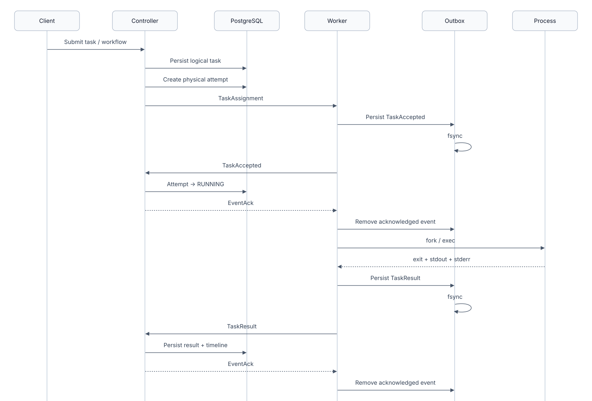
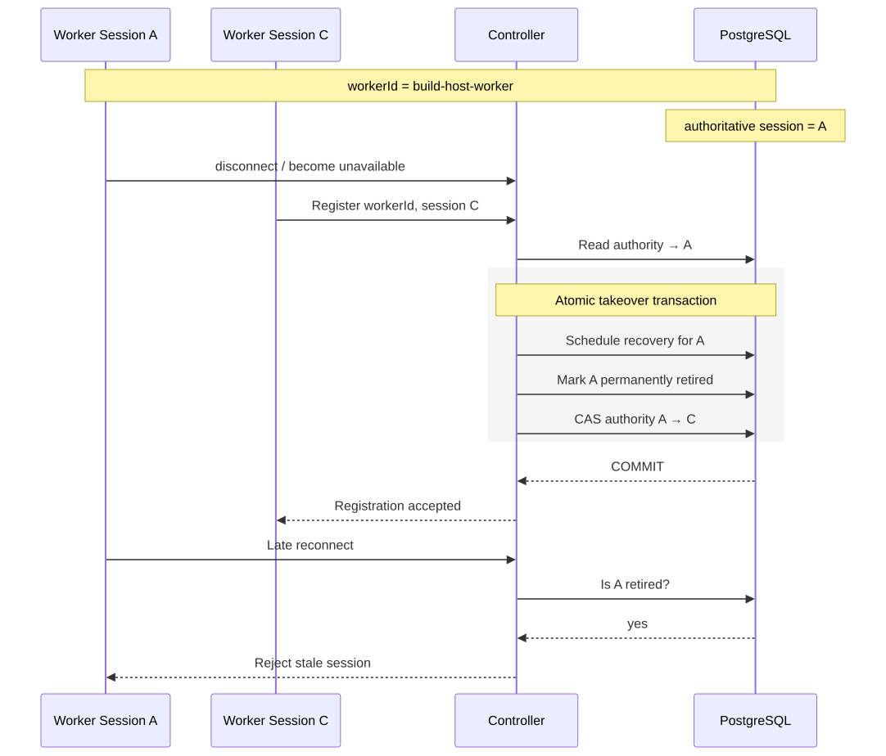

# Architecture

This document describes the architecture implemented in the repository today. Forge has two independently deployed runtimes—a Java controller and one or more C++ workers—plus PostgreSQL and a worker-local durable outbox.

## Design goals

- Preserve task, attempt, workflow, ownership, and timeline state across controller restarts.
- Prevent stale worker processes from mutating current execution state.
- Deliver worker lifecycle events across transient disconnects without reordering them.
- Keep logical task state separate from physical execution attempts.
- Support dependency-aware workflows without allowing invalid or cyclic graphs.
- Make cancellations, worker loss, retry eligibility, and recovery observable.

## Component view

### Controller

The controller exposes REST resources on port `8080` and starts a separate gRPC server on port `50051`. Its main responsibilities are:

- validate and persist standalone tasks and workflow DAGs;
- create a new attempt for each physical execution;
- reserve capacity and dispatch work to the least-loaded eligible worker;
- consume idempotently identified worker events and acknowledge them;
- coordinate dependency release, retries, cancellations, health checks, and restart recovery;
- expose current state and append-only execution timelines.

PostgreSQL is the source of truth for workflows, tasks, attempts, worker authority, retired sessions, delayed recovery, and execution events. Live worker connections and metrics are intentionally held in memory.

### Worker

The worker maintains a stable `workerId` derived from its hostname and generates a unique `sessionId` for every process incarnation. It:

- registers capabilities and reports CPU, memory, and running-task metrics every five seconds;
- maintains a bidirectional command stream and automatically reconnects;
- executes commands in a bounded pool of `min(cpuCores, 4)` threads;
- gives each command its own POSIX process group so cancellation reaches descendants;
- captures stdout, stderr, exit code, timeout, and cancellation outcomes;
- persists task-accepted and task-result events locally before sending them.

The outbox defaults to `$HOME/.forge/outbox/<workerId>` and can be relocated with `FORGE_OUTBOX_DIR`.

## Successful execution flow

### Ordering and acknowledgement

Worker events use deterministic IDs derived from the attempt: `<attemptId>:accepted` and `<attemptId>:result`. `ReliableEventSender` maintains insertion order, withholds events until the persistence barrier succeeds, replays every unacknowledged durable event when the stream changes, and deletes its `.event` file only after a controller ACK. The controller serializes ACK writes with outbound assignments and cancellation commands.

This is an at-least-once transport pattern. Correctness therefore depends on the controller validating the worker session and treating repeated event identities idempotently.

## Task lifecycle

`maxAttempts` limits automatic physical executions to 1–10. A failed attempt becomes eligible after exponential backoff: 5, 10, 20, 40 seconds and so on, capped at 300 seconds. The retry coordinator checks once per second. Pending dispatch and dependency reconciliation each run every 500 milliseconds.

The workflow status is derived from its task states rather than stored independently. A workflow is successful only when every task succeeds. Exhausted failures take precedence and, together with skipped downstream nodes, produce `FAILED`; otherwise cancellation produces `CANCELLED`, while in-flight or retryable work produces `RUNNING`.

## Worker authority and recovery

The stable worker ID is not enough to identify an executing process. Two incarnations may overlap during a crash, network partition, or restart. Forge pairs it with a per-process session ID and keeps durable ownership state.

Important recovery windows:

- **Heartbeat timeout:** the controller checks every five seconds and marks a worker lost after 15 seconds without an accepted heartbeat.
- **Session replay grace:** after takeover, the previous session receives a durable 10-second window in which already-persisted events can be reconciled before its active attempts are marked lost.
- **Controller cold-start grace:** after controller restart, a persisted authoritative session gets 10 seconds to reconnect before a fresh session can take over.
- **Startup task recovery:** interrupted `DISPATCHED` and `RUNNING` state is reconciled before the gRPC server begins accepting connections, while durable recovery rows prevent premature loss during valid replay windows.

Retired sessions are persisted separately from short-lived recovery rows. This prevents a stale process from becoming authoritative again after its grace record has expired.

## Persistence model

Worker authority tables have no foreign key to the in-memory worker registry. They preserve coordination facts even when no worker is connected. Schema evolution is append-only through `controller/src/main/resources/db/migration` and Hibernate runs in `validate` mode.

## Scheduling

Scheduling and capacity reservation occur inside one synchronized controller method. Eligible workers must be online, have an attached command stream, and have spare task capacity. Selection is ordered by:

1. effective load (`max(runningTasks, outstandingReservations)`);
2. reported CPU usage;
3. worker ID, for deterministic ties.

The selected worker is reserved before the scheduler lock is released. This prevents concurrent REST and coordinator activity from over-selecting the same worker. Capacity is process-local, which is one reason the current controller is intentionally single-instance.

## Consistency boundaries

- Database transactions protect workflow creation, workflow retry reset, session takeover, and durable recovery reconciliation.
- Task dispatch persists ownership before writing the gRPC assignment.
- Workflow cancellation persists workflow-level intent before sweeping child tasks, allowing restart recovery to finish an interrupted sweep.
- Worker results are accepted only for the current worker session and matching attempt ownership.
- Scheduled coordinators are defensive: they re-read current state and tolerate work changing between selection and mutation.

## Known architectural boundaries

- The REST and gRPC surfaces are unauthenticated; gRPC uses insecure channel credentials.
- Worker commands run with the worker process account and are not sandboxed.
- The controller is designed as a single process; worker registry and scheduling reservations are not distributed.
- There is no admission control, tenant isolation, artifact store, log streaming, metrics backend, or trace propagation.
- Outbox durability is local to a worker filesystem; losing that disk can lose unacknowledged events.
- API errors are plain text rather than a versioned structured error envelope.

These are explicit extension points, not hidden production claims. See [Operations](operations.md) and [Security](../SECURITY.md) for deployment implications.
